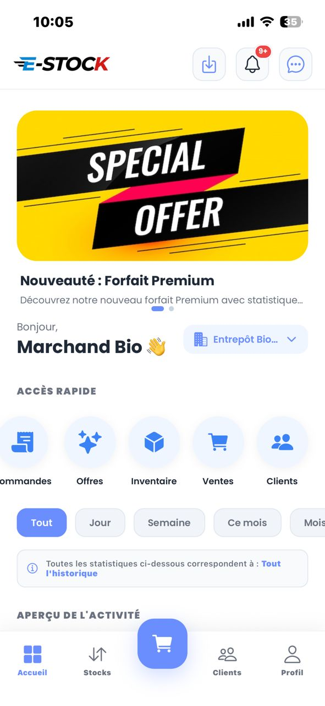
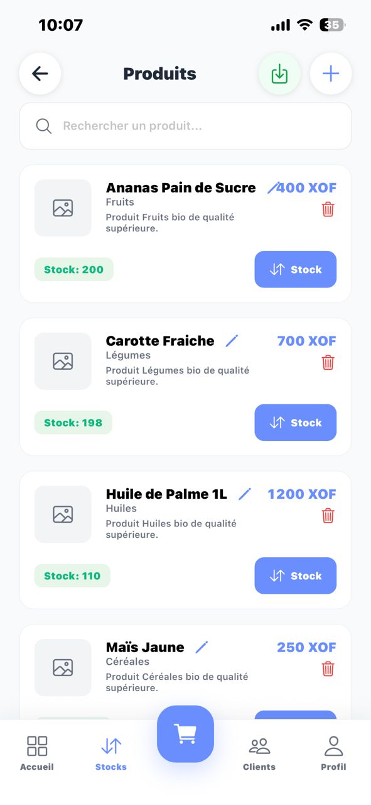
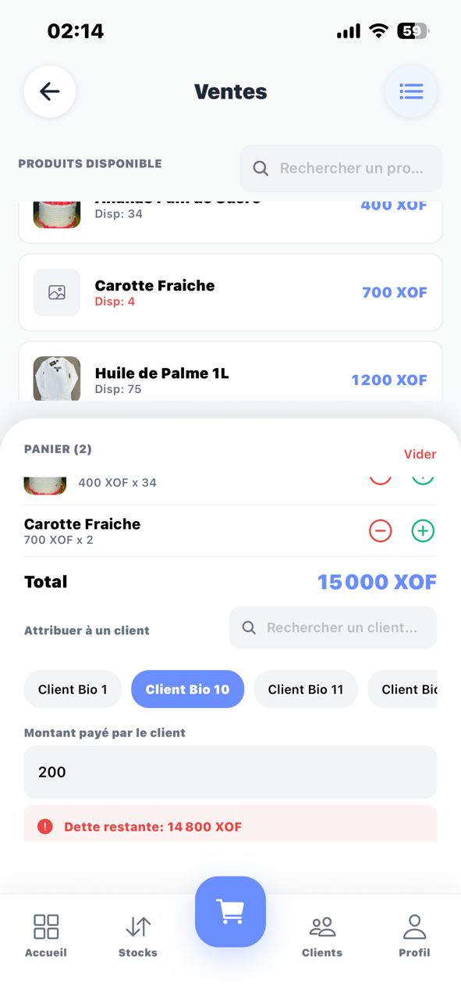
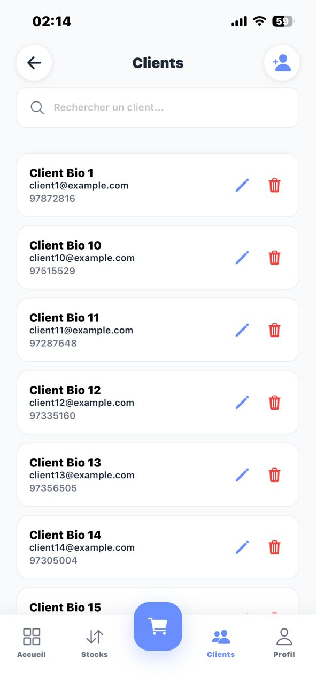
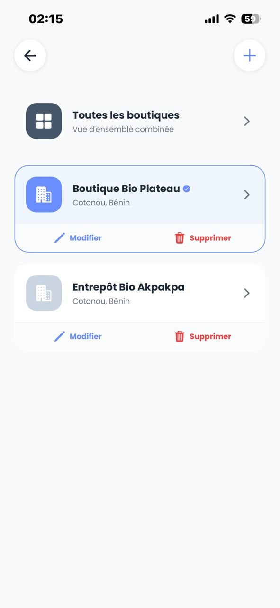
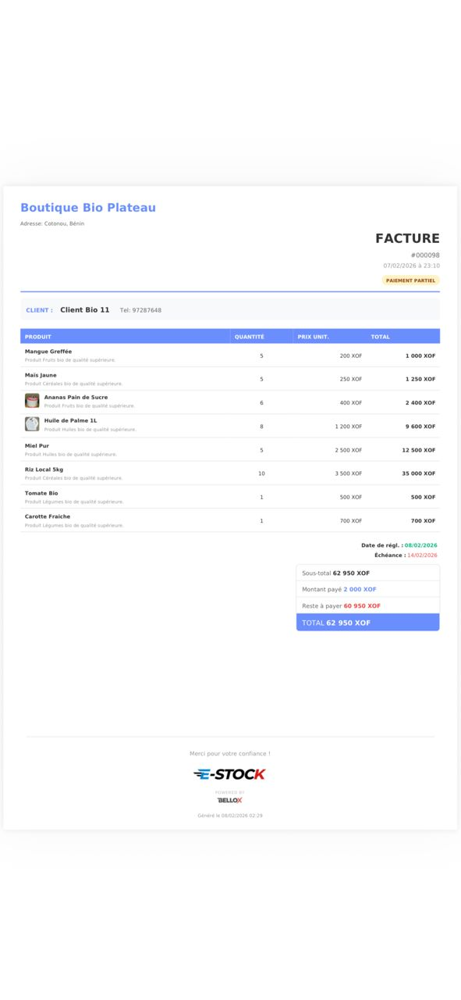

# Gestion de Stock

Application de gestion de stock avec React Native (mobile) et Laravel (backend API).

## 🎥 Démonstration

<div align="center">
  
[](./Demonstration/site.webm)

### 📸 Captures d'écran

<table>
  <tr>
    <td></td>
    <td></td>
    <td></td>
  </tr>
  <tr>
    <td></td>
    <td></td>
    <td></td>
  </tr>
</table>

</div>

## 📁 Structure du Projet

```
GestionStock/
├── backend/          # API Laravel
│   ├── app/
│   ├── routes/
│   ├── database/
│   └── ...
└── mobile/           # Application React Native
    ├── src/
    ├── android/
    ├── ios/
    └── ...
```

## 🚀 Installation

### Backend (Laravel)

1. Accédez au dossier backend :
```bash
cd backend
```

2. Installez les dépendances :
```bash
composer install
```

3. Configurez votre fichier `.env` :
```bash
cp .env.example .env
php artisan key:generate
```

4. Configurez votre base de données dans `.env` :
```env
DB_CONNECTION=mysql
DB_HOST=127.0.0.1
DB_PORT=3306
DB_DATABASE=gestion_stock
DB_USERNAME=root
DB_PASSWORD=
```

5. Exécutez les migrations :
```bash
php artisan migrate
```

6. Lancez le serveur :
```bash
php artisan serve
```

L'API sera accessible sur `http://localhost:8000`

### Mobile (React Native)

1. Accédez au dossier mobile :
```bash
cd mobile
```

2. Installez les dépendances :
```bash
npm install
```

3. Pour Android :
```bash
npx react-native run-android
```

4. Pour iOS (Mac uniquement) :
```bash
cd ios && pod install && cd ..
npx react-native run-ios
```

## 🛠️ Technologies Utilisées

### Backend
- **Laravel 12** - Framework PHP
- **MySQL/SQLite** - Base de données
- **Laravel Sanctum** - Authentification API

### Mobile
- **React Native 0.83** - Framework mobile
- **React Navigation** - Navigation
- **Axios** - Requêtes HTTP

## 📝 Configuration de l'API

Pour connecter l'application mobile à l'API Laravel, modifiez l'URL de base dans votre configuration React Native :

```javascript
// mobile/src/config/api.js
export const API_URL = 'http://localhost:8000/api';
```

Pour tester sur un appareil physique, remplacez `localhost` par l'adresse IP de votre ordinateur.

## 🔐 Authentification

L'API utilise Laravel Sanctum pour l'authentification. Les endpoints principaux :

- `POST /api/register` - Inscription
- `POST /api/login` - Connexion
- `POST /api/logout` - Déconnexion
- `GET /api/user` - Utilisateur connecté

## 📱 Fonctionnalités Prévues

- [ ] Gestion des produits
- [ ] Gestion des catégories
- [ ] Gestion du stock
- [ ] Authentification utilisateur
- [ ] Tableau de bord
- [ ] Rapports et statistiques

## 🤝 Contribution

Ce projet est en cours de développement.

## 📄 Licence

Ce projet est sous licence MIT. Développé par **BELLOX**.

Rappel des comptes de test :
Marchand par défaut : marchand@bio.com / password123 (Boutique bio déjà remplie).
Admin par défaut : admin@boss.com / password123 (Gestion plateforme).
